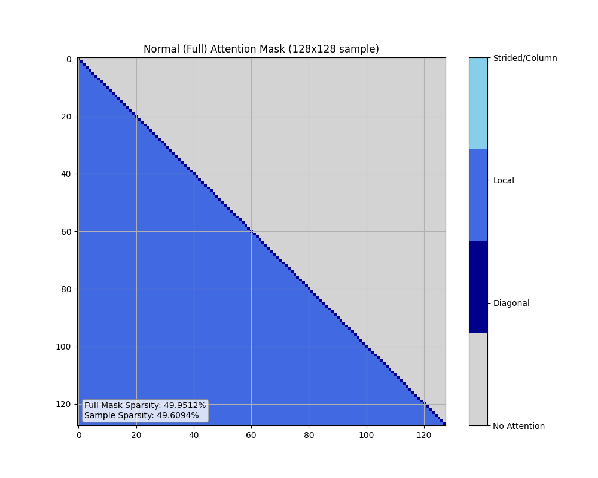
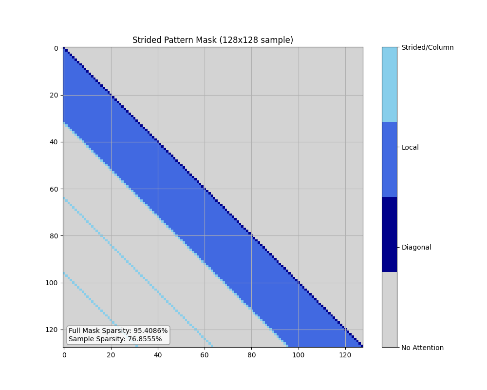
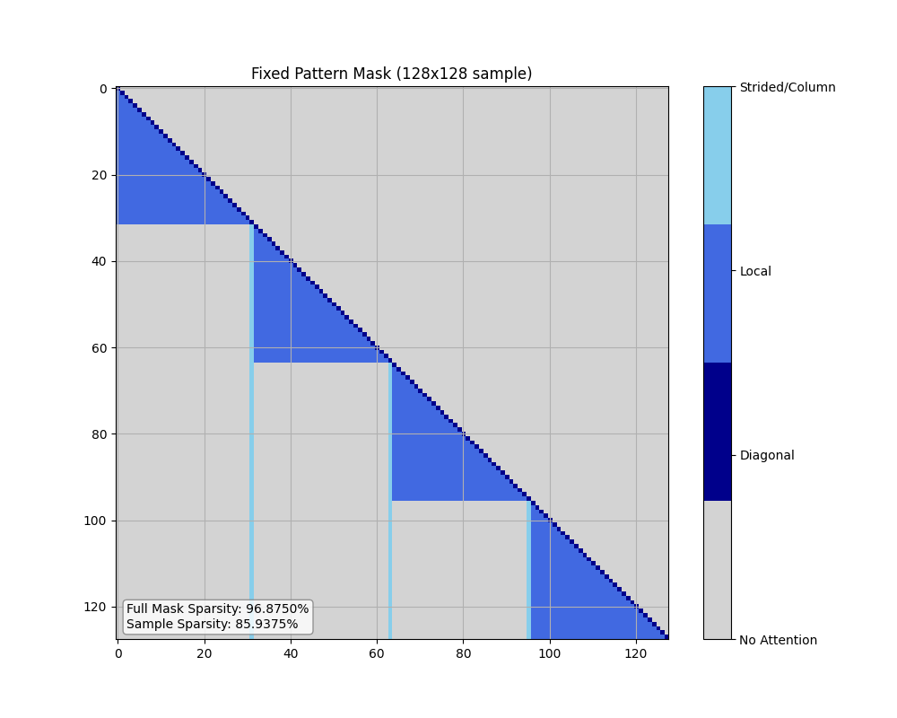
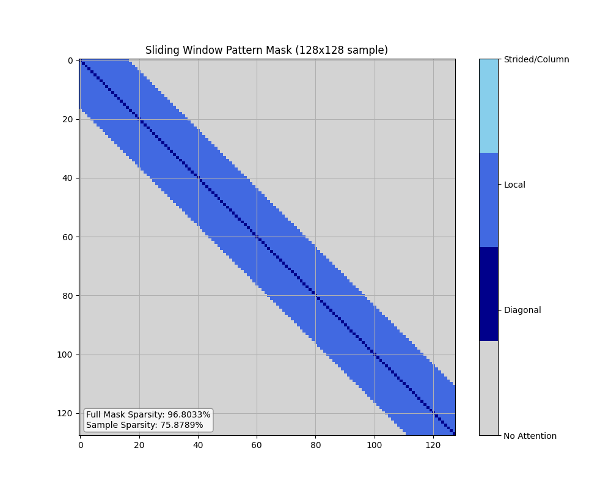
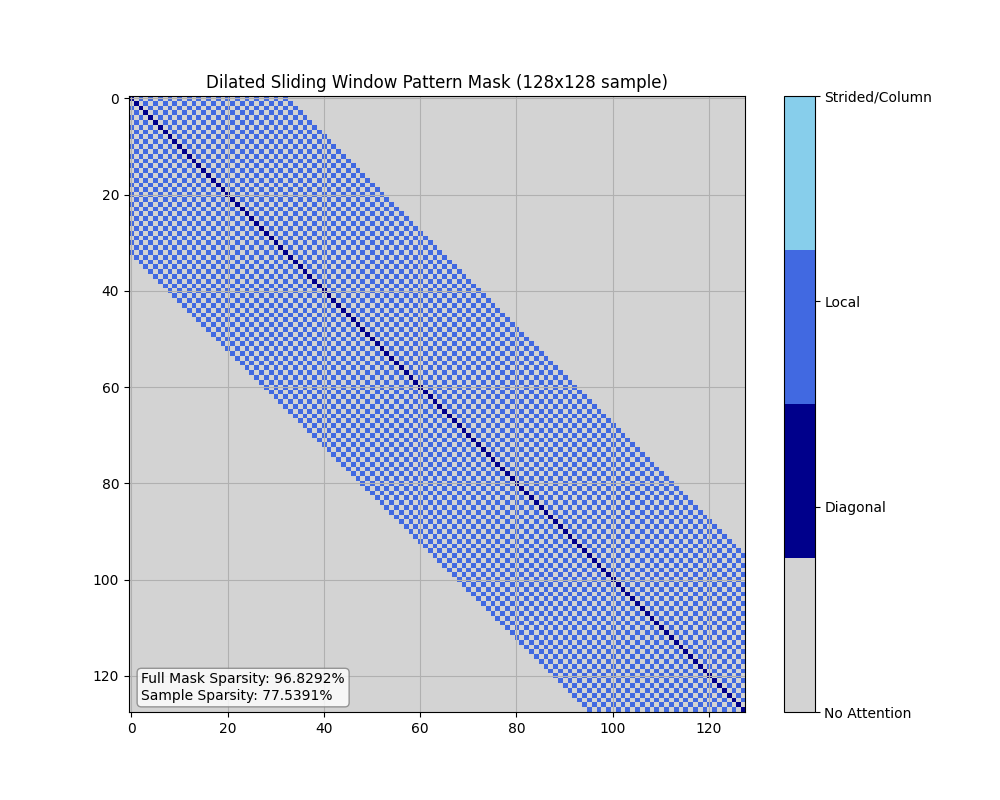
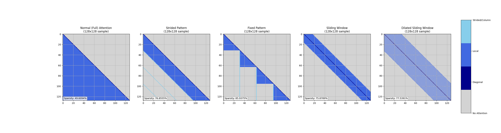

# CIFAR-10용 Sparse Transformer 어텐션 마스크

**For English version, see [README.md](README.md).**

이 프로젝트는 CIFAR-10 이미지 데이터(32x32 픽셀 = 1024 토큰)에 대한 sparse(희소) 어텐션 패턴을 구현하고 시각화합니다. Sparse 어텐션 패턴은 모델의 지역 및 전역 의존성 포착 능력을 유지하면서 계산 복잡도와 메모리 사용량을 크게 줄여줍니다.

## 어텐션 패턴

다섯 가지 어텐션 패턴이 구현되어 있습니다:

### 1. 일반(Full) 어텐션

일반 어텐션 패턴은 표준 causal 어텐션을 구현합니다:
- **대각선 자기-어텐션(값 1)**: 각 토큰이 자기 자신에 attend
- **하삼각 어텐션(값 2)**: 각 토큰이 이전 모든 토큰에 attend

이 패턴의 희소성은 **49.6%** 입니다(상삼각 부분만 마스킹).



### 2. Strided 패턴

Strided 패턴은 세 가지 어텐션을 결합합니다:
- **대각선 자기-어텐션(값 1)**: 각 토큰이 자기 자신에 attend
- **로컬 윈도우 어텐션(값 2)**: 각 토큰이 윈도우 내 인접 토큰에 attend
- **Strided 어텐션(값 3)**: 각 토큰이 일정 간격의 이전 토큰에 attend

윈도우 크기와 스트라이드가 32일 때 약 **95.4% 희소성**을 가집니다.



### 3. Fixed 패턴

Fixed 패턴은 다음과 같습니다:
- **대각선 자기-어텐션(값 1)**: 각 토큰이 자기 자신에 attend
- **블록 단위 로컬 어텐션(값 2)**: 각 토큰이 같은 블록 내 이전 토큰에 attend
- **고정 컬럼 어텐션(값 3)**: 각 토큰이 각 이전 블록의 마지막 토큰에 attend

블록 크기 32일 때 약 **96.9% 희소성**을 가집니다.



### 4. Sliding Window 패턴

각 토큰이 고정 크기 윈도우 내 이웃 토큰에 attend (자기 자신 제외):
- **대각선 자기-어텐션(값 1)**
- **슬라이딩 윈도우 어텐션(값 2)**

윈도우 크기 32일 때 약 **96.8% 희소성**을 가집니다.



### 5. Dilated Sliding Window 패턴

각 토큰이 dilation 간격으로 떨어진 위치에 attend:
- **대각선 자기-어텐션(값 1)**
- **dilated sliding window 어텐션(값 2)**

윈도우 크기 32, dilation 2일 때 약 **96.8% 희소성**을 가집니다.



## 구현 세부사항

이 프로젝트는 하나의 Python 파일로 구성되어 있으며 다음 기능을 제공합니다:

- 단계별 마스크 생성 함수
- 마스크 시각화 도구
- 희소성 계산 및 통계
- 다양한 어텐션 패턴의 나란히 비교 시각화

## 사용법

### 어텐션 마스크 생성

```python
from sparse_transformer_mask import (
    create_normal_mask_step_by_step,
    create_strided_mask_step_by_step,
    create_fixed_mask_step_by_step,
    create_sliding_window_mask_step_by_step,
    create_dilated_sliding_window_mask_step_by_step
)

# 일반(Full) 어텐션 마스크 생성
normal_mask = create_normal_mask_step_by_step(size=1024)

# Strided 마스크 생성
strided_mask = create_strided_mask_step_by_step(size=1024, window_size=32, stride=32)

# Fixed 마스크 생성
fixed_mask = create_fixed_mask_step_by_step(size=1024, window_size=32)

# Sliding Window 마스크 생성
sliding_window_mask = create_sliding_window_mask_step_by_step(size=1024, window_size=32)

# Dilated Sliding Window 마스크 생성
dilated_sliding_window_mask = create_dilated_sliding_window_mask_step_by_step(size=1024, window_size=32, dilation=2)
```

#### 1024 토큰의 경우에 대한 Sparsity 정보
```
Sparsity of each mask:
Normal Mask Sparsity: 49.9512%
Strided Mask Sparsity: 95.4086%
Fixed Mask Sparsity: 96.8750%
Sliding Window Mask Sparsity: 96.8033%
Dilated Sliding Window Mask Sparsity: 96.8292%
```

### 바이너리 마스크로 변환

생성된 마스크는 어텐션 타입을 구분하기 위해 1, 2, 3 값을 가지지만, 실제 트랜스포머 모델에서는 0과 1로만 구성된 바이너리 마스크로 변환해야 합니다:

```python
import numpy as np
from sparse_transformer_mask import convert_to_binary_mask

# 바이너리 마스크로 변환 (0이 아닌 값은 모두 1)
binary_strided_mask = convert_to_binary_mask(strided_mask)
binary_fixed_mask = convert_to_binary_mask(fixed_mask)

# 바이너리 마스크 희소성 확인
binary_sparsity = 1.0 - np.count_nonzero(binary_strided_mask) / binary_strided_mask.size
print(f"Binary mask sparsity: {binary_sparsity:.4%}")
```

### 마스크 시각화

```python
from sparse_transformer_mask import visualize_mask_sample
import matplotlib.pyplot as plt

# 마스크 시각화용 컬러맵 설정
custom_cmap = plt.cm.colors.ListedColormap(['lightgray', 'darkblue', 'royalblue', 'skyblue'])

# 64x64 샘플 시각화
visualize_mask_sample(
    mask=strided_mask,
    title='Strided Pattern Mask',
    sample_size=64,
    colormap=custom_cmap,
    save_path='strided_mask_64x64.png'
)
```

### 여러 어텐션 패턴 비교 시각화

```python
from sparse_transformer_mask import visualize_mask_comparison

# 다섯 가지 어텐션 패턴을 나란히 비교 (각각 128x128 샘플)
visualize_mask_comparison(
    masks=[
        normal_mask[:128, :128],
        strided_mask[:128, :128],
        fixed_mask[:128, :128],
        sliding_window_mask[:128, :128],
        dilated_sliding_window_mask[:128, :128]
    ],
    titles=[
        'Normal (Full) Attention',
        'Strided Pattern',
        'Fixed Pattern',
        'Sliding Window',
        'Dilated Sliding Window'
    ],
    sample_size=128,
    colormap=custom_cmap,
    save_path='mask_comparison_128x128.png'
)
```



### 스크립트 직접 실행

```bash
python sparse_transformer_mask.py
```

이 명령은 다음을 수행합니다:
1. Normal, Strided, Fixed, Sliding Window, Dilated Sliding Window 마스크(모두 1024x1024)를 생성
2. 각 마스크 타입의 샘플을 시각화
3. 다섯 가지 패턴의 128x128 샘플을 나란히 비교하는 그림 생성

## 컬러 매핑

시각화는 다음과 같은 custom colormap을 사용합니다:
- **회색 (값 0)**: 마스킹(No Attention)
- **진한 파랑 (값 1)**: 대각선/자기-어텐션
- **로얄 블루 (값 2)**: 로컬 어텐션(또는 normal 패턴의 하삼각)
- **스카이 블루 (값 3)**: Strided/고정 컬럼 어텐션

## 이론적 효율성

시퀀스 길이 1024(32x32 CIFAR-10 이미지) 기준:

- **표준 어텐션**: O(n²) = 1,048,576 연산
- **희소 어텐션**(95% sparsity): O((1-s)·n²) = 52,428 연산
- **이론적 속도 향상**: 약 20배

## 요구사항

- Python 3.6+
- NumPy
- Matplotlib

## 참고문헌

- [Sparse Transformer (Child et al., 2019)](https://arxiv.org/abs/1904.10509)
- [Longformer (Beltagy et al., 2020)](https://arxiv.org/abs/2004.05150)
- [BigBird (Zaheer et al., 2020)](https://arxiv.org/abs/2007.14062) 